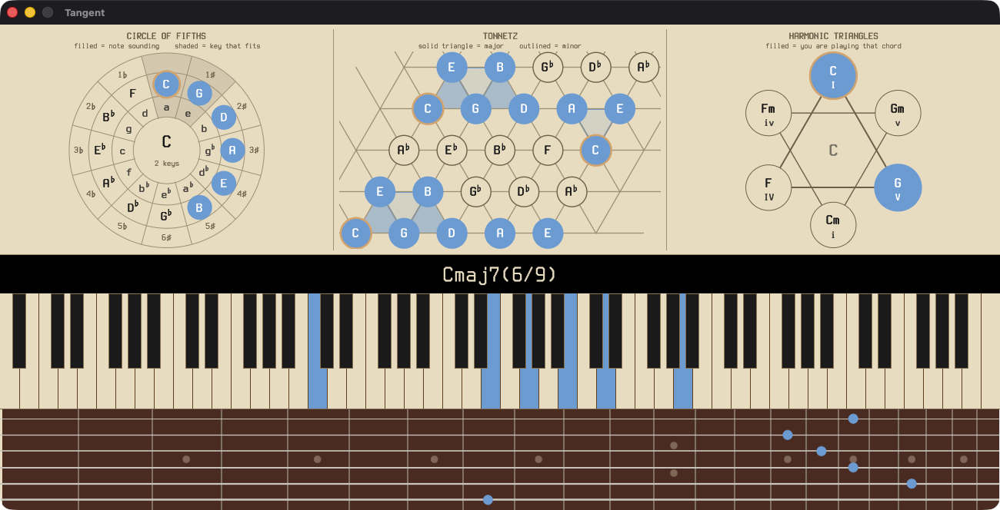
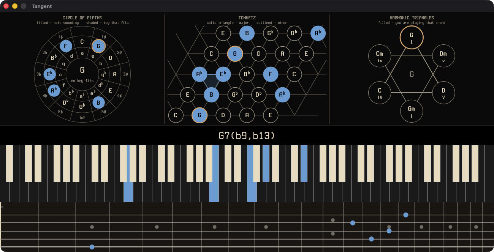

# Tangent

**See every note. Understand every chord.**

### [⬇ Download](https://github.com/ganten1998/ivory/releases/latest) &nbsp;·&nbsp; [♥ Support Tangent](https://ganten.gumroad.com/l/ivory)



Tangent is a MIDI keyboard monitor with advanced chord detection. Plug in a MIDI
keyboard and Tangent renders all 88 keys (A0 to C8) in real time while a
weighted-scoring chord engine names what you are playing, from plain triads to
altered dominants, rootless jazz voicings, slash chords, and scales.

It also shows you the same notes **on a guitar neck**, where a player would
actually put their fingers, and **as geometry**: on the circle of fifths, on a
Tonnetz, and as the I-IV-V triangles.



Since 3.0.0 it runs **inside a DAW as well**, as a VST3 plugin with the same
display. Tangent 2.x and later are a ground-up Rust rewrite of the Python app
(final Python release: 1.1.0), keeping the same look, behaviors, and settings
file. It runs on macOS 11 (Big Sur) and later, on Windows, and on Linux
(glibc 2.32+, ALSA, Wayland or X11).

## Download

The **installer** is the easy option: it offers the app and the VST3 plugin as
separate choices, so you can take either or both, and it puts the plugin where
your DAW already looks.

| Platform | Installer | Or unpack it yourself |
|---|---|---|
| macOS 11+ | [`.pkg`](https://github.com/ganten1998/ivory/releases/latest/download/Tangent-macos.pkg) | [`.dmg`](https://github.com/ganten1998/ivory/releases/latest/download/Tangent-macos-universal.dmg) · [`.zip`](https://github.com/ganten1998/ivory/releases/latest/download/Tangent-macos-universal.zip) |
| Windows 10+ | [`setup.exe`](https://github.com/ganten1998/ivory/releases/latest/download/Tangent-windows-setup.exe) | [`.zip`](https://github.com/ganten1998/ivory/releases/latest/download/tangent-windows-x86_64.zip) |
| Linux x86_64 | `install.sh`, inside the tarball | [`.tar.gz`](https://github.com/ganten1998/ivory/releases/latest/download/tangent-linux-x86_64.tar.gz) |

macOS builds are universal from 3.0.0, Apple Silicon and Intel, and signed
and notarized. The Linux `install.sh` needs no root by default and takes
`--app`, `--vst3`, `--system`, `--prefix`, `--uninstall` and `--dry-run`.

### The plugin

Tangent.vst3 shows everything the app does, reading the notes on the track it
is on. **It produces no audio.** It is a monitor, not an instrument, so put
it on a MIDI or instrument track rather than in an effect slot. Its settings
live in the DAW project, so two instances and the standalone can each be set
up differently.

## Features

- **Real-time 88-key display.** Every key lights as you play it, with
  sustain-pedal visualization (held notes stay lit and recolor while the pedal
  is down).
- **Chord detection, 95 chord patterns against all 12 roots.** Triads
  (maj/min/dim/aug), sevenths (maj7, m7, dom7, m7b5, dim7), extensions
  (9/11/13), altered dominants (b9, #9, #11, b13 and combinations), add chords,
  sus chords (sus2, sus4, 9sus, 13sus), 6 and 6/9, inversions, slash chords,
  and rootless voicings.
- **28 scales and modes.** Clustered note runs are named as scales rather than
  chords: the seven major modes, the melodic and harmonic minor modes, both
  pentatonics, both blues scales, whole tone, and both diminished scales.
- **Readable labels** in parenthetical notation: `C(add9)`, `C7(b9,#11)`,
  `Cm(add9)/G`, `CΔ7`, `6/9`, with lead sheet symbols `Δ`, `°`, `ø` and `+`.
  Flats and sharps preference toggle.
- **A theory band.** A tall section above everything else with three ways of
  seeing what you are playing, in any combination, side by side.
  - **Circle of fifths.** Each key shaded by how much of what you are playing
    belongs to it, so keys that are close light up together. A filled disc for
    every note you are sounding: a triad is a tight cluster, a tritone is a
    line straight across. Relative minors sit on the same spoke as their major,
    because they share a key signature.
  - **Tonnetz.** The lattice where left-to-right is fifths and the diagonals
    are thirds, so every major triad is a triangle pointing up, every minor
    triad one pointing down, and two chords that share two notes share an edge.
  - **Harmonic triangles.** I, IV and V pointing up with i, iv and v inverted
    through the same centre. Between them those three chords use every note of
    the key and no others, which is why so many songs need no more.

  It shows what you **put there** rather than what you are playing, so it holds
  still while your hands are busy: click the piano, the neck or the diagrams
  themselves. *Follow MIDI* makes it live if you would rather.
- **Keyboard shortcuts.** Hold **H** for the list. **N** names the chord you are
  holding. The box opens with the current name selected, so you just type.
  **E** corrects a reading, **M** opens what you have taught, **T** cycles the
  theory band, **G** the guitar view, and **K**, **R**, **C**, **D**, **B**,
  **F**, **L**, **P**, **A**, **S** the rest.
- **Teach Tangent your names.** Right-click, then *Teach Chord Name…* pins your
  own name to the voicing you are holding. Tick *Apply in all keys* to make the
  name follow the shape through every transposition. *Manage Taught Chords…*
  lists and deletes taught names. Overrides are consulted before detection and
  stored in `~/.config/ivory/overrides.json`.
- **Chord Learning.** *Correct Chord Name…* shows the readings Tangent actually
  weighed for the voicing you are holding, with their scores. Pick the one you
  would rather see and Tangent learns a general leaning, so similar voicings shift
  too, a measured ~1 chord in 10 across a 13,133-voicing corpus, often in other
  keys. *Forget Learning* in *Manage Taught Chords…* restores stock naming
  exactly. *Disable Chord Learning* silences it without erasing anything.
- **Guitar view, both ways.** *Show Fretboard* adds a neck under the piano and puts the
  notes you are holding where a guitarist would actually play them. One MIDI
  note can be six places on a guitar. Middle C is five of them, and the high E
  string cannot reach it at all, so Tangent picks the shape a player would use,
  weighing hand span, open strings and barres, then holds it steady as you add
  notes rather than jumping around the neck. Seven tunings including a 4-string
  bass, plus a capo. Notes that will not fit are never quietly missing: an
  out-of-range note shows as a hollow dot with the octave it moved, a note the
  guitar cannot sound alongside the others shows as a faint ring where it wanted
  to go, and anything left off is counted underneath. Three fingerboard woods
  (rosewood, maple, ebony), and the neck pops out into its own window. The capo
  cycles black, brushed silver and wood when you click it.

  It is an **input** too: with Keytoggle on, click the neck to place notes and
  read the chord off the piano above, instead of only the other way round.
  Shapes stay where you put them. Hold and drag along a fret to lay a barre,
  which is the only way to get one by hand, so two notes that happen to share a
  fret stay two notes.
- **A VST3 plugin.** The same display inside your DAW, reading the notes on the
  track it is on. It produces no audio, so put it on a MIDI or instrument track.
  Settings live in the project, so instances can differ from each other and
  from the standalone. macOS is a signed universal binary.
- **Detachable chord display.** Pop the chord strip into its own independent
  window, and close it to reattach.
- **Dark mode** with theme-aware context menus (ivory-on-black and
  black-on-ivory), customizable key and note colors.
- **Flexible window.** Size presets from 50% to 200% (any percentage works in
  the settings file), borderless mode with drag-anywhere support.
- **MIDI device picker.** Tangent auto-connects at startup, preferring ports named
  "USB-MIDI", then "Scarlett" or "USB"+"MIDI", and otherwise the first port it
  finds. Switch at any time with *Select MIDI Input…*. There is no
  auto-reconnect, so reopen the picker if a device is unplugged mid-session.
  CLI flags for scripted setups: `tangent -l` lists MIDI input ports,
  `tangent -p "<port name>"` connects to a specific one.
- **Consistent typography everywhere.** The Courier Prime fonts are bundled and
  embedded, so the app looks identical on all three platforms. Terminess Nerd
  Font Mono is bundled as an alternative.

The right-click context menu is the primary UI surface. Every feature above is
reachable from it.

## Pay what you can

Tangent is free software (MIT) and free to download. Every feature, Chord Learning
included, is in the free app. Nothing is time-limited and nothing nags you.

A [supporter key](https://ganten.gumroad.com/l/ivory) is a way to say the app
earned a place in your practice room. It adds a small cosmetic thank-you inside
the app and nothing else. Pay what you like, and if you cannot afford it, just
use the app.

## Privacy

Tangent makes no network connections and collects no data. Your settings and your
taught chords stay on your machine, in `~/.config/ivory/`. There is no telemetry,
no update check, and no account. Supporter keys are verified offline with a
signature check, so no server is contacted then either. The only link anywhere in
the app, the author's site in the About box, hands the address to your browser if
you click it. Tangent itself never opens a socket.

## A note on the name

Tangent was called **Ivory** until 2.3.0, and "ivory" survives as the internal
codename throughout the source: the crate names, `~/.config/ivory/`, the macOS
bundle identifier, and the `IVORY_*` developer switches. That is deliberate, not
leftovers. Changing the bundle identifier would reset Gatekeeper's trust in every
signed build, and changing the config path would orphan every existing user's
settings and taught chords, both for a string nobody using the app ever sees.

The clavichord's tangent is the brass blade at the back of each key. It strikes
the string and stays in contact with it for as long as the note sounds, which is
what the display does with a held note.

Downloads published under the old `Ivory-*` asset names keep working; every
release uploads those alongside the current ones.

## Licensing

The standalone app and every crate in this repo are **MIT**. The VST3 plugin
binary is **GPL-3.0-or-later**, because NIH-plug's VST3 bindings are, and
copyleft attaches to the binary that links them rather than to the source.

Shipping both in one installer is an aggregate under GPLv3 section 5, so the
standalone stays MIT. `LICENSING.md` records the reasoning and the three rules
that keep it true.

## Building from source

Requires a stable Rust toolchain (rustup recommended).

```sh
cargo run --bin tangent         # debug build, run directly
cargo build --release --bin tangent
cargo test --workspace        # engine + parity test suite
```

Release packaging lives in `scripts/`: `build-macos.sh` for the signed and
notarized macOS bundle, `build-cross.sh` for the Windows cross-build, and
`build-linux-native.sh` which must be run on a Linux host. Linux cannot be
cross-compiled from macOS, because `alsa-sys` has no sysroot to find. See
`docs/RELEASE.md` for the full procedure.

## Platform notes

- **macOS.** Release builds are signed with a Developer ID certificate and
  notarized by Apple, with the ticket stapled to the bundle, so the app opens on
  a double-click with no Gatekeeper prompt and no need to be online.
- **Windows.** The executable is unsigned, so SmartScreen shows "Windows
  protected your PC" on first run. Click **More info**, then **Run anyway**.
  Code-signing certificates for individual developers cost a few hundred a year,
  and this app is free, so that is on hold for now.
- **Linux.** Untar the release archive, `chmod +x tangent`, and run `./tangent`.
  MIDI goes through ALSA, so `libasound.so.2` must be present (`libasound2` on
  Debian and Ubuntu, `alsa-lib` elsewhere). PipeWire systems work unchanged,
  since the keyboard still appears as an ordinary ALSA sequencer port. The
  archive includes `tangent.desktop`, an icon, and the fonts if you want a desktop
  entry. The fonts themselves are already embedded in the binary. Wayland and
  X11 are both supported, though some tiling and Wayland compositors treat
  Tangent's fixed window sizes as advisory.

## Fonts and licensing

Tangent's executable embeds six font files, all free and libre. Every release
artifact carries the full license text for each one.

**Courier Prime** (Regular and Bold) is the UI typeface, Copyright 2015 The
Courier Prime Project Authors, licensed under the
[SIL Open Font License 1.1](https://openfontlicense.org). Its license text
(`OFL.txt`) ships alongside the fonts. Tangent does **not** bundle or
redistribute Courier New.

**Terminess Nerd Font Mono** is bundled as an optional UI typeface, selectable
from the context menu. Copyright (C) 2020 Dimitar Toshkov Zhekov and (C) 2023
Tilman Blumenbach, also under the SIL Open Font License 1.1. Its license text
ships as `font-licenses/Terminess-OFL-1.1.txt`.

Four more fonts come in automatically with eframe/egui's `default_fonts`
feature (the `epaint_default_fonts` crate) and serve as glyph fallback for
anything Courier Prime does not cover. The context menu's submenu arrow (⏵), for
instance, exists only in `emoji-icon-font`. Their license texts ship in the
`font-licenses/` folder of every artifact:

| Font | Copyright | License | Text |
|---|---|---|---|
| Ubuntu Light | 2011 Canonical Ltd. | Ubuntu Font Licence 1.0 | `font-licenses/Ubuntu-Font-Licence-1.0.txt` |
| Noto Emoji | 2013 Google Inc. | SIL OFL 1.1 | `font-licenses/NotoEmoji-OFL-1.1.txt` |
| Hack | 2018 Source Foundry Authors; 2003 Bitstream, Inc. | MIT + Bitstream Vera | `font-licenses/Hack-LICENSE.txt` |
| emoji-icon-font | 2014 John Slegers | MIT | `font-licenses/emoji-icon-font-MIT.txt` |

No font is modified, subset, or sold standalone. Tangent's own MIT grant
([LICENSE](LICENSE)) covers Tangent's code only. The embedded fonts remain under
the licenses above. A `custom_font_path` setting lets you point Tangent at any
TTF or OTF installed on your own machine instead.

## Settings compatibility with Tangent 1.1.0

Tangent reads and writes the same settings file as the Python app,
`~/.config/ivory/settings.json`, at that literal path on **all** platforms, with
the same keys and formats. Upgrading from Python Tangent 1.1.0 carries all your
settings over untouched. Tangent 2.x adds a single optional key
(`custom_font_path`, edited by hand, since there is no UI for it) and preserves
any keys it does not recognize.

One-way caveat: if you later run Python Tangent 1.1.0 again, it rewrites the file
with its fixed key set, discarding `custom_font_path` and any other additions.
Taught chord names live in a separate file (`overrides.json`) that the Python app
never touches.

## Changes

Release history, including the Python lineage, is in
[CHANGELOG.md](CHANGELOG.md).

## Thanks

- **Omer**, for the rounded macOS app icon, the one Tangent wears in the Dock
  and in Finder.
- **Hatsu**, for extensive Windows testing and feedback, on a platform the
  author does not develop on and could not have got right alone.
- **Joanne**, for knowing what the sheet music panel had to be before it
  existed. The staff view is in Tangent because of them, and it reads the way
  it does because of what they said about the first attempt.

## License

MIT, see [LICENSE](LICENSE). Copyright (c) 2025-2026 Ganten.
Licenses of the Rust crates Tangent links against are collected in
[THIRD-PARTY-LICENSES](THIRD-PARTY-LICENSES).

MIT means you may rebuild, modify and redistribute Tangent freely.
